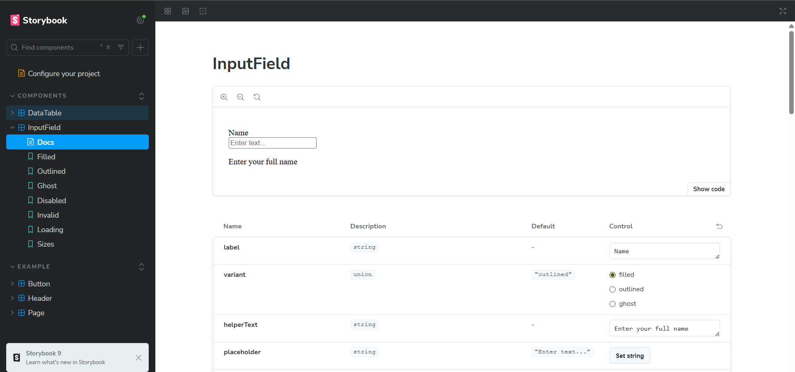
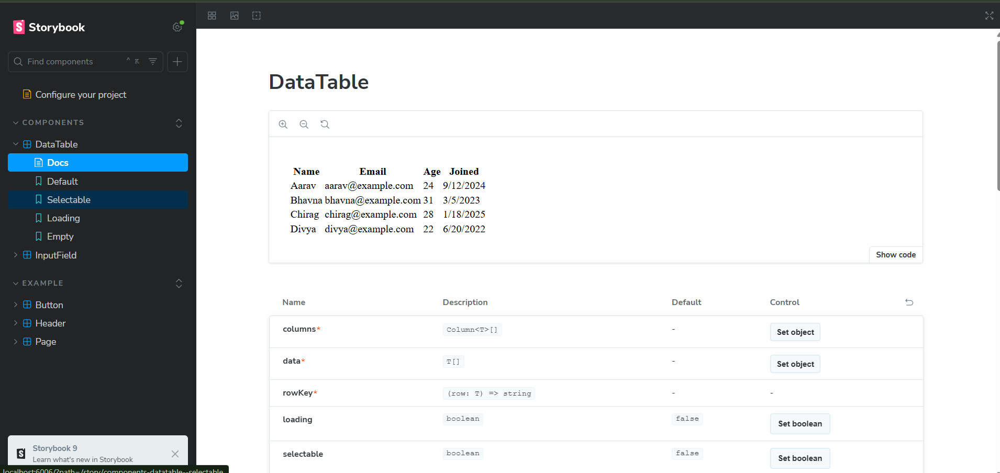

# React UI Components Assignment

## Overview
This project is an internship assignment to build **two reusable UI components** using React, TypeScript, TailwindCSS, and Storybook.

### Components
- **InputField** → A flexible input with:
  - Variants: `filled`, `outlined`, `ghost`
  - Sizes: `sm`, `md`, `lg`
  - States: `disabled`, `invalid`, `loading`
  - Supports helper text & error messages

- **DataTable** → A reusable table with:
  - Column sorting
  - Row selection (checkboxes)
  - Loading state
  - Empty state

---

## Tech Stack
- React + TypeScript
- Tailwind CSS
- Storybook

---

## How to Run the Project

1. **Clone the repository**
   ```bash
   git clone https://github.com/tejs87/react-ui-components-assignment.git
   cd react-ui-components-assignment

2. **Install dependencies**
This will install React, TailwindCSS, Storybook, and other packages:
   ```bash
   npm install 

3. **Run the React App**
   ```bash
   npm start

4. **Run Storybook
   ```bash
   npm run storybook

## Features
- Built with React + TypeScript
- Styled using Tailwind CSS
- Components displayed in Storybook

## Screenshots
### React App


### Storybook – InputField Component


### Storybook – DataTable Component


